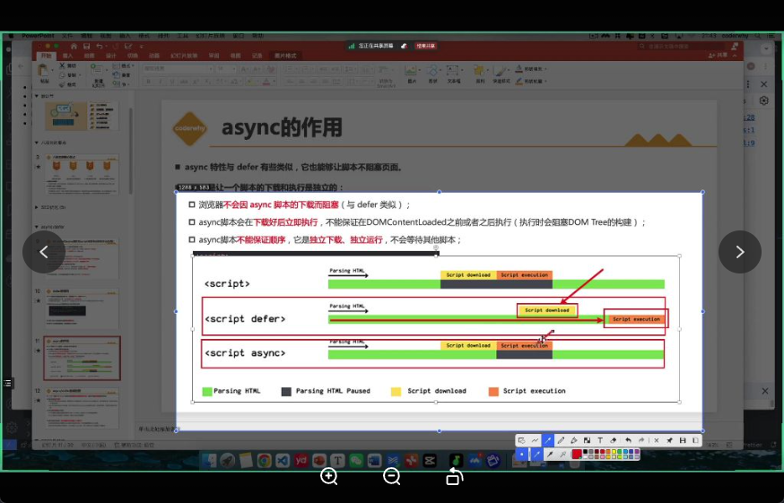

# defer 与 async

---

## 一、作用总览  
| 属性 | 本质 | 核心目标 |
|---|---|---|
| `defer` / `async` | HTML 元素属性（attribute） | 让外部脚本不再阻塞 HTML 解析，提升加载性能 |

---

## 二、运行机制对比  

| 维度 | defer | async |
|---|---|---|
| 下载过程 | 并行下载，**不阻塞 DOM 构建** | 并行下载，**不阻塞 DOM 构建** |
| 执行时机 | **DOM 构建完成后**、DOMContentLoaded 事件 **前** | **下载完立即执行**，与 DOM 是否完成无关 |
| 执行顺序 | **按文档出现顺序**依次执行 | **谁先下载完谁先执行**，无顺序保证 |
| 是否阻塞渲染 | 执行时**不阻塞**（因 DOM 已构建完） | 执行时**会阻塞** HTML 解析（瞬间暂停） |

---

## 三、典型场景速查  

| 场景 | 推荐属性 | 原因 |
|---|---|---|
| 需操作 DOM 的业务代码 | `defer` | DOM 已构建，安全操作 |
| 多脚本有依赖关系 | `defer` | 保证顺序 |
| 第三方统计 / 广告 | `async` | 独立、无依赖、越早越好 |
| 对渲染顺序敏感的资源 | 不用 `async` | 避免不可预期的执行点 |

---

## 四、工程实践提示  

1. **现代构建工具**（Webpack / Vite）已自动为 chunk 加 `defer`，无需手动干预。  
2. **手动优化点**：  
   - Google Analytics 等统计代码 → 官方默认 `async`。  
   - 广告追踪脚本 → 通常 `async`，若依赖 DOM 可改 `defer`。  
3. **脚本位置**：  
   - `defer` 脚本→直接放 `<head>`，可尽早启动下载。  
   - `async` 脚本→推荐 `</body>` 前，降低阻塞渲染风险。  
4. **特殊需求** → 用 `<link rel="preload">` 提前拉高下载优先级，再按场景选 `defer` 或 `async`。

---

## 五、defer 细节补充  

1. 告诉浏览器：**继续解析 HTML**，别等脚本下载。  
2. 下载完成后**先待命**，直到 DOM Tree 构建完毕。  
3. **总在 DOMContentLoaded 之前**按文档顺序执行。  
4. 放 `<head>` 或 `<body>` 都不影响顺序，只与源码顺序有关。  

```html
<head>
  <script defer src="a.js"></script>
</head>
<body>
  …大量 HTML…
  <script defer src="b.js"></script>
</body>
<!-- 执行顺序：a.js → b.js，与物理位置无关 -->
```

---

## 六、async 细节补充  

### 1. 下载阶段  
- 独立线程，**不阻塞 HTML 解析**。  

### 2. 执行阶段  
- 下载完**立即执行**，此时**暂停 HTML 解析**（瞬间阻塞）。  

### 3. 顺序特性  
- 多个 `async` 脚本**无序**；先返回先执行。  

### 4. 对比记忆  
| 对比项 | 结果 |
|---|---|
| vs 普通脚本 | 下载不阻塞解析 |
| vs `defer` | 不等待 DOM 完成，执行点不可预期 |

> 适用：无依赖、不操作 DOM、越早运行越好的独立模块。  
> 慎用：有执行顺序要求或需访问 DOM 的代码。

---

