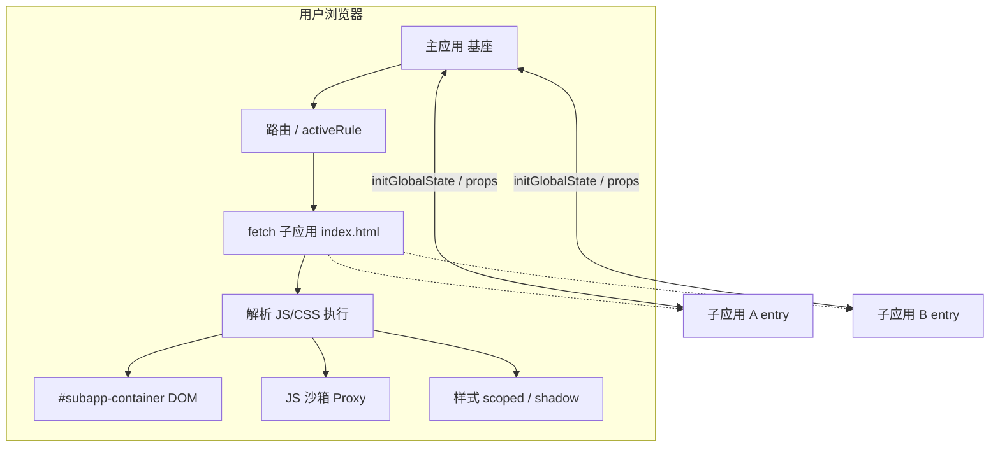

# 09 · 微前端与 qiankun（后台专项 · 详细版）

> 面向：**Vue 后台 + qiankun 主/子应用** 日常开发与面试。  
> 课程原文：`难点攻关/09.微前端解决巨石应用/`  
> 官方文档：[qiankun.umijs.org](https://qiankun.umijs.org/zh)

---

## 一、用一句话说清楚

**一个后台太大、多团队、多技术栈** → 拆成多个 **可独立开发部署的子应用**，由 **主应用（基座）** 按路由加载到页面里的一块 DOM 上；**qiankun** 是在 **single-spa** 之上封装了 **HTML Entry、JS/CSS 沙箱、全局通信** 的国内最常用方案。

你们已经在用 qiankun，本章不是「要不要上」，而是：**原理是什么、坑在哪、面试怎么讲、和单体 Vue 开发差在哪**。

---

## 二、微前端解决什么问题？（后台场景）

课件里的典型场景，和你们 B 端后台高度重合：

| 场景 | 说明 |
|------|------|
| 陈年巨石 | 老 Vue2/React 不敢动，新业务要用新栈 |
| 多团队并行 | 订单、库存、权限、报表各一队，不想共用一个 `npm run build` |
| 统一入口 | 老板要一个管理后台 URL，底下多个历史系统要「拼」进来 |
| 独立发布 | 改报表子应用不必整站回归 |

### 微前端的四个原则（面试可内化，别背课本原话）

1. **技术栈无关** — 子应用 A 用 Vue2，B 用 Vue3/React 可以（代价是基建要跟上）。  
2. **独立开发、独立部署** — 各自仓库/各自 CI。  
3. **增量迁移** — 先迁一块业务，不是一次性重写。  
4. **业务隔离** — 按业务域拆，**高内聚、低耦合**；通信需求多的别硬拆成两个子应用。

### 什么时候「不要」微前端（也要会说）

- 团队小、就一个后台、没有历史包袱 → **单体 + 模块联邦/拆路由** 更简单。  
- 为了微前端而微前端 → 复杂度（联调、沙箱、样式、监控）会反噬。  
- 子应用之间 **频繁强耦合** → 应先治业务边界，再谈拆分。

---

## 三、方案对比：为什么你们用 qiankun 而不是 iframe？

| 方案 | 优点 | 缺点（后台里很痛） |
|------|------|-------------------|
| **iframe** | 隔离彻底 | URL 不同步、弹窗/遮罩出不来、cookie 免登麻烦、每次进子应用整页重建慢、监控难 |
| **Nginx 按路径分发** | 运维简单 | 切应用整页刷新、应用间通信弱 |
| **npm 包嵌入** | 性能好 | 版本协调地狱、越来越臃肿 |
| **qiankun / micro-app / 无界** | 体验接近 SPA、可通信、可沙箱 | 接入成本高、要踩坑 |
| **Module Federation** | 模块级共享 | 强依赖 Webpack5、css/js 沙箱弱，国内主应用级方案不如 qiankun 普遍 |

**面试话术**：我们先考虑过 iframe，但 B 端需要 **统一路由、弹窗、登录态、体验不刷新**，所以选运行时微前端；对比 qiankun / micro-app / 无界 后选 qiankun，因 **社区案例多、HTML Entry 接入老项目成本低**。

---

## 四、整体架构（心里要有这张图）



- **主应用**：菜单、顶栏、登录、注册子应用、`start()`。  
- **子应用**：完整 SPA，只是多导出 **qiankun 生命周期**，被主应用 **挂载/卸载**。  
- 用户仍是一个站点，URL 由主应用 + 子应用路由协作。

---

## 五、qiankun 核心 API（你要会写、会讲）

### 1. 注册与启动（主应用）

```js
import { registerMicroApps, start, initGlobalState } from 'qiankun';

registerMicroApps([
  {
    name: 'app-order',           // 唯一，与子应用 package name 对应更好
    entry: '//localhost:7101',   // 子应用 html 地址（开发/生产）
    container: '#subapp-viewport',
    activeRule: '/order',        // 激活路径，支持函数
    props: { token, routerBase: '/order' }, // 传给子应用
  },
  {
    name: 'app-report',
    entry: '//localhost:7102',
    container: '#subapp-viewport',
    activeRule: '/report',
  },
]);

// 全局状态（主子通信）
const actions = initGlobalState({ user: null, theme: 'light' });
actions.onGlobalStateChange((state, prev) => { /* 主应用更新 */ });

start({
  prefetch: true,              // 预加载子应用静态资源
  sandbox: {
    strictStyleIsolation: false,  // shadow DOM，弹窗易挂
    experimentalStyleIsolation: true, // scoped 类名前缀，常用
  },
});
```

### 2. 子应用生命周期（Vue 最常见）

子应用 **不能** 只 `new Vue().$mount('#app')` 就完事，必须导出：

| 钩子 | 何时调用 | 你该做什么 |
|------|----------|------------|
| `bootstrap` | 首次加载前，只一次 | 全局初始化（少用） |
| `mount` | 进入路由、挂载到 container | `createApp().mount(container.querySelector('#app'))` |
| `unmount` | 离开路由、切换子应用 | `app.unmount()`、销毁监听、**取消请求** |
| `update` | 可选，props 变化 | 按需 |

**Vue3 示意（理解用）：**

```js
let app = null;

export async function bootstrap() {
  console.log('order app bootstrap');
}

export async function mount(props) {
  const { container, routerBase, onGlobalStateChange, setGlobalState } = props;
  app = createApp(App);
  // 路由 base 要与 activeRule 一致
  app.use(router(routerBase));
  app.mount(container.querySelector('#app'));
  onGlobalStateChange?.((state) => { /* 同步用户/权限 */ });
}

export async function unmount() {
  app?.unmount();
  app = null;
  // 取消未完成的 axios、清定时器 → 见第 03 章
}
```

### 3. HTML Entry（qiankun 和 single-spa 的关键区别）

- **JS Entry**：子应用打成一个 bundle，css/图片都打进去，慢、不灵活。  
- **HTML Entry**：主应用 `fetch(子应用入口.html)` → 解析出 `<script>` / `<link>` → 依次执行 → 把内容挂到 `container`。

**对你意味着**：子应用仍是 **正常 Vite/Webpack 打包**，但要配好 **publicPath**（资源绝对路径），否则挂到主应用域名下会 404。

---

## 六、两大共性问题（课件 + 实战）

### 问题 1：加载与切换

- **activeRule** 与主应用路由、菜单高亮一致。  
- **entry** 开发用 `//localhost:端口`，生产用 CDN/子域。  
- **prefetch**：空闲时预拉子应用资源，首进下一个子应用更快（也占带宽）。  
- 切换子应用 = 上一个 `unmount` + 下一个 `mount`，**不是** iframe 整页重载。

### 问题 2：隔离与通信

见下面第七、八、九节。

---

## 七、JS 沙箱（面试高频）

**问题**：子应用写 `window.xxx = 1` 会污染主应用和其他子应用。

**做法**：每个子应用一个 **假 window（Proxy）**，读写走代理，读不到再回落真 `window`。

| 类型 | 特点 |
|------|------|
| 快照沙箱 | 激活/失活时 diff 真 window；**不支持多实例**（qiankun 旧场景） |
| Proxy 沙箱 | 现代 qiankun 默认方向；**多子应用并存** |

**你日常会遇到的「沙箱关不掉」的情况**：

- 有些库必须挂真 `window`（老插件）。  
- 子应用里动态插入的 script 逃逸。  
- 排查：看是否该用 `singular: false`、是否多个子应用同时激活。

---

## 八、CSS 隔离（后台里坑最多）

| 方案 | 说明 | 后台痛点 |
|------|------|----------|
| **experimentalStyleIsolation**（scoped） | 给选择器加前缀 | 同名 class 仍可能撞；Element Plus 弹层要注意 |
| **strictStyleIsolation**（Shadow DOM） | 真隔离 | **弹窗挂 body**，样式丢了；React 事件委托也可能怪 |

### 弹窗 / 遮罩 / 下拉（必踩坑）

Element Plus / Ant Design Vue 的 `Dialog`、`Select` 下拉常 **teleport 到 `document.body`**：

- 跳出子应用 container → **主应用全局样式** 影响它。  
- Shadow 模式下 → **子应用样式** 管不到它。

**常见处理**（按项目选）：

- `appendTo` 指到子应用容器内（若组件支持）。  
- 主应用提供 **公共弹层样式**。  
- 约定 Design Token / 主应用统一样式文件。

---

## 九、应用通信（别和「跨标签页」混了）

| 方式 | 适用 | 注意 |
|------|------|------|
| **initGlobalState** | 用户、权限、主题、菜单折叠 | 官方推荐；子应用通过 props 拿 `setGlobalState` / `onGlobalStateChange` |
| **props** | 主应用传 token、routerBase | 主子耦合，但清晰 |
| **URL / 路由** | 弱通信、可分享链接 | 解耦，能力弱 |
| **CustomEvent** | 简单事件 | 易命名冲突 |
| **子应用 ↔ 子应用** | **不要直连** | 课件原则：**都找主应用中转** |

和 **第 12 章跨标签页** 的区别：

- **qiankun**：同一标签页内，主应用 + 多个子应用运行时。  
- **BroadcastChannel**：多个浏览器标签页之间。  
- 后台常见：**登录态** 可能既要 qiankun 全局状态，又要多标签 `storage` 同步退出。

---

## 十、Vue 子应用接入检查清单（对照你们项目）

### 构建 / 部署

- [ ] `publicPath` / `base` 生产环境为 **完整 URL 或 CDN 前缀**（`//cdn.xxx.com/order-app/`）  
- [ ] 开发环境 `devServer.headers` 允许跨域（主应用 fetch 子 html）  
- [ ] 输出 **umd 库名** 或 qiankun 要求的打包配置（Vue3 + Vite 有官方推荐插件/配置，以你们脚手架为准）  
- [ ] 路由 **base** 与 `activeRule` 一致（如 `/order`）

### 运行时

- [ ] 导出 `bootstrap` / `mount` / `unmount`  
- [ ] `unmount` 里 **unmount 实例 + 清副作用**（第 03 章 AbortController）  
- [ ] 不要重复注册全局组件/插件（二次 mount 会重复）  
- [ ] Pinia/Vuex：考虑是否每 mount 新建 store 实例

### 主应用

- [ ] `registerMicroApps` 的 `name` 唯一  
- [ ] `container` DOM 在 layout 里始终存在  
- [ ] 菜单路由跳转能触发 `activeRule`  
- [ ] 全局错误监控带 **子应用 name**（第 11 章）

### 依赖

- [ ] **Vue / VueRouter 是否 externals**？避免主、子各打一份 Vue（体积 + `createApp` 怪异 bug）  
- [ ] 若共享依赖，版本必须 **主应用统一提供**

---

## 十一、和其他「难点攻关」章节怎么配合

| 章节 | 在 qiankun 后台里的用法 |
|------|-------------------------|
| **03 请求取消** | 子应用 `unmount`、路由离开时 abort |
| **08 虚拟列表** | 某个子应用里大表格性能 |
| **10 DNS** | 主应用对 **各子应用 entry 域名** `dns-prefetch` / `preconnect` |
| **11 监控** | 上报字段加 `microAppName`、release 版本 |
| **12 跨标签** | 多标签退出登录、草稿同步（与全局状态互补） |
| **16 defer** | 某个子应用首页/dashboard 组件过多时分帧挂载 |
| **07 表单** | 子应用内长表单草稿，仍可 FormStorage |

---

## 十二、常见故障排查（值班向）

| 现象 | 可能原因 |
|------|----------|
| 子应用白屏 | entry 404、publicPath 错、生命周期未 export、容器为空 |
| 静态资源 404 | `publicPath` 写成 `/` 但部署在子路径 |
| 样式乱 / 弹窗没样式 | 隔离模式 + teleport 到 body |
| 点击菜单不加载 | `activeRule` 与路由不一致、history/hash 模式混用 |
| 切换后接口仍回调 | 未 abort、未 unmount 干净 |
| 两个 Vue 版本冲突 | 未 externals，主应用与子应用各一份 vue |
| 本地联调跨域 | 子应用 devServer `Access-Control-Allow-Origin` |

**调试技巧**：Network 看主应用是否成功 fetch 子应用 `index.html`；Console 看 qiankun 生命周期日志；Vue Devtools 看 mount 了几次根实例。

---

## 十三、框架对比表（面试展开用）

| | qiankun | micro-app | 无界 | Module Federation |
|--|---------|-----------|------|-------------------|
| 加载 | HTML Entry | Web Component 标签 | iframe + 优化 | 构建时共享模块 |
| 接入成本 | 高 | 低 | 低 | 中（Webpack5） |
| 隔离 | Proxy + scoped/shadow | Shadow/scoped | iframe 级 | 弱 |
| 社区/案例 | 最广 | 上升 | 腾讯系 | Webpack 生态 |
| Vite 子应用 | 需按文档配 | 官方称有坑 | 相对友好 | 看构建链 |

**你们选 qiankun 的合理说法**：B 端多历史项目、要 HTML Entry 渐进接入、团队已有蚂蚁系实践、问题能搜到解决方案。

---

## 十四、子应用怎么拆？（比背 API 更重要）

课件 / 面试的 **架构向** 回答：

1. **按业务域拆**，保持核心子业务独立。  
2. **关联紧的放一个子应用**（通信频繁别硬拆）。  
3. **先看页面结构**，交叉多就先合并。  
4. **先粗后细**，别一开始拆太碎。  
5. 原则：**拆系统复杂度，合系统复用度 — 高内聚低耦合**。

---

## 十五、面试 STAR 模板（后台 + qiankun）

**S**：公司 B 端后台多年、多团队、技术栈不一，发布牵一发动全身。  
**T**：统一入口、子系统独立发布、老代码渐进迁移，不能影响客户使用。  
**A**：对比 iframe 后选 qiankun；按业务域拆子应用；主应用注册 + 全局状态；解决 publicPath、弹窗样式、依赖 externals；监控按子应用区分。  
**R**：子应用独立开发部署；用户无感迁移；新需求落在对应子应用，回归范围缩小。

### 可埋钩子

- 为什么不用 iframe？  
- qiankun 原理（HTML Entry、沙箱）？  
- 样式弹窗怎么解决？  
- 子应用怎么拆？  
- 和 micro-app 区别？

---

## 十六、学习资料

| 资源 | 路径 / 链接 |
|------|-------------|
| 课程技术讲义 | `09.微前端解决巨石应用/09-技术讲解.md` |
| 课程面试讲义 | `09.微前端解决巨石应用/09-面试讲解.md` |
| 官方 | https://qiankun.umijs.org/zh/guide |
| 本系列索引 | [求职难点攻关 README](./README.md) |

---

## 十七、自测（搞懂了吗）

- [ ] 能画主应用、子应用、entry、container、activeRule 的关系  
- [ ] 能说出 HTML Entry 和 iframe 各一个优缺点  
- [ ] 能解释 Proxy 沙箱在防什么  
- [ ] 知道弹窗挂 body 时样式为什么丢、怎么处理  
- [ ] 能说明子应用通信为什么建议经主应用  
- [ ] 能列出 Vue 子应用 mount/unmount 必做事项  
- [ ] 能结合你们后台说 **为什么用 qiankun、拆了几个子应用**

---

**给你（已在用 qiankun）的优先级**：先熟 **生命周期 + publicPath + 路由 base + 通信**，再补 **样式弹窗 + externals**，最后 **面试拆分逻辑 + 框架对比**。其他 15 章按 [README](./README.md) 里「后台 + qiankun」优先级学即可。
